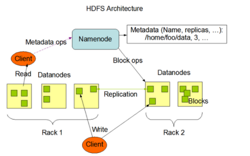
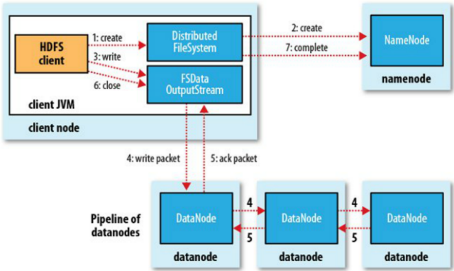
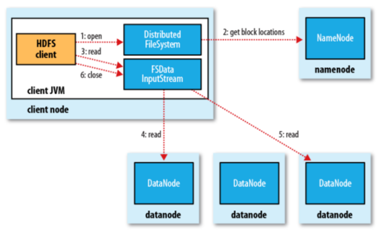

# HBase

## 基础概述

### Where?

[官方网址：https://hadoop.apache.org/](https://hadoop.apache.org/) 

[官方文档：https://hadoop.apache.org/docs/r3.2.1/](https://hadoop.apache.org/docs/r3.2.1/) 

[官方下载：https://archive.apache.org/dist/hadoop/common/](https://archive.apache.org/dist/hadoop/common/) 

### Why?

随着数据量越来越大，在一个操作系统磁盘空间肯定存不下了，那么就需要分配到更多的操作系统管理的磁盘中，也就是常说的分布式存储-集群多机器存储。

但是涉及多个机器存储，就不方便管理和维护。HDFS就是一个很好的分布式文件管理系统。它使用多台机器（一般是Linux）机器上的特定磁盘空间作为文件系统的存储空间，相当于整合了多台机器的存储空间为自己所用。扩大了存储空间。

对于文件来说，HDFS也作出了一些特有的设计方式。它将每一个文件切分成多个块进行存储，将切分后的块分散存储到多台机器上，Hadoop2.x版本中默认块大小是128MB。

比如一个文件大小300MB，那么在HDFS中，会被切分成三个数据块（128MB，128MB，44MB），三个块都是独立的，它们会被存储在不同的机器上。

这样做的好处就是不会有超大文件的影响，最大的块只有128MB，对机器性能要求不高，可以部署在廉价的机器上。

### What?

#### 设计思想

1. 将文件进行切分
2. 一个文件被切分后，被分成多少块，每个块存储在哪些机器上，这些都是需要记录的，不然，文件存进去了，不能查出来
3. 数据丢失的问题，HDFS可以部署在廉价的机器上，那就会存在某个机器损坏，导致数据丢失，也就是说HDFS还得提供容错功能。HDFS采用的是副本机制，对切分后的文件块进行备份

#### 组成架构

从图中可以分析到，架构主要由四个部分组成，分别为`HDFS Client`、`NameNode`、`DataNode`和`Secondary NameNode`。下面我们分别介绍这四个组成部分。



##### 1.Client

客户端，自己编写的代码+Hadoop API。主要功能：

1. 进行文件切分。文件上传HDFS的时候，Client将文件切分成一个一个的Block，然后进行存储
2. 当我们要查询一个文件时，与NameNode交互，获取文件的位置信息
3. 与DataNode交互，读取或者写入数据
4. Client提供一些命令来管理HDFS，比如启动或者关闭HDFS
5. Client可以通过一些命令来访问HDFS。

##### 2.NameNode

Master，它是一个主管、管理者。也叫HDFS的元数据节点。集群中只能有一个活跃的NameNode对外提供服务

1. 管理HDFS的名称空间（文件目录树）；HDFS很方便的一点就是对于用户来说很友好，用户不考虑细节的话，看到的目录结构和我们使用Window和Linux文件系统很像
2. 管理数据块（Block）映射信息及副本信息；一个文件对应的块的名字以及块被存储在哪里，以及每一个文件备份多少都是由NameNode来管理
3. 处理客户端读写请求

##### 3.DataNode

Slave。实际存储数据块的节点，NameNode下达命令，DataNode执行实际的操作

1. 存储实际的数据块

2. 执行数据块的读/写操作

   工作机制: 一个数据块在DataNode上以文件形式存储在对应服务器的磁盘上，包括两个文件，一个是数据本身，一个是元数据包括数据块的长度，块数据的校验和，以及时间戳。 DataNode启动后向NameNode注册，通过后，周期性（1小时）的向NameNode上报所有的块信息。 心跳是每3秒一次，心跳返回结果带有NameNode给该DataNode的命令，如复制块数据到另一台机器，或删除某个数据块。如果超过10分钟没有收到某个DataNode的心跳，则认为该节点不可用。 集群运行中可以安全加入和退出一些机器。

##### 4.Secondary NameNode

并非NameNode的热备。当NameNode挂掉的时候，它并不能马上替换NameNode并提供服务。它的功能如下

1. 辅助NameNode，分担其工作量

2. 定期合并Fsimage和Edits，并推送给NameNode

3. 在紧急情况下，可辅助恢复NameNode。 

   Secondary NameNode的工作与HDFS设计是相关的，主要针对元数据设计的。它维护了两种文件Fsimage和Edits，Fsimage镜像文件，是元数据在某个时间段的快照，Edits记录了生成快照之后的一些列操作。HDFS在最初格式化启动时，创建Edits和Fsimage文件，并在内存中维护一版元数据信息，这时候，Fsimage和内存中的元数据信息是相同的。后续每一次客户端操作时，会先记录客户端执行的操作，这个操作是记录Edits在文件中的，然后再更新内存中对应的目录树结构，比如用户删除一个文件，会先在Edits文件中记录一个delete操作，然后在内存中真正删除改文件。也就是说，内存中的元数据信息是完整的。前面生成的快照Fsimage只是元数据的一部分，执行完Edits文件中相关操作才能与内存中元数据相同。 为什么要这么设计呢？ 首先，为什么不直接更新Fsimage，而是要新添加Edits文件。这里就需要明确Fsimage里面存的是元数据目录树信息，其实是一个内存对象序列化后的内容。要更新这个文件，首先得反序列化对象加载到内存中，在实际工作，这个文件是很大，序列化和反序列化过程会很繁重，速度会很慢。而Edits文件只需要append操作记录即可。这样既保证了元数据不会丢失，也提高了性能。 SecondaryNameNode具体干什么事情？ 当HDFS运行一段时间后，需要重启动时，需要将Fsimage加载到内存中，并把Eidts文件中的操作执行一遍，才是完整的元数据信息。假如操作记录比较频繁或者长时间没有重启过，Edits文件会很大。重启的时候合并Fsimage+Edits文件的操作也是很耗时的，增加了启动时间。SecondaryNameNode就是这种问题的，它是一个独立的进程，定期（满足一定条件）会将Fsimage+Edits合并成一个新的Fsimage，减少HDFS重启时间。

#### 优缺点

##### 优点

1. 高容错性

   数据自动保存多个副本。它通过增加副本的形式，提高容错性。 

   某一个副本丢失以后，它可以自动恢复

2. 适合大数据处理

   数据规模：能够处理数据规模达到GB、TB、甚至PB级别的数据。 

   文件规模：能够处理百万规模以上的文件数量，数量相当之大

3. 流式数据访问，它能保证数据的一致性

4. 可构建在廉价机器上，通过多副本机制，提高可靠性


##### 缺点

1. 不适合低延时数据访问，比如毫秒级的存储数据，是做不到的

2. 无法高效的对大量小文件进行存储
   - 存储大量小文件的话，它会占用NameNode大量的内存来存储文件、目录和块信息。这样是不可取的，因为NameNode的内存总是有限的
   - 小文件存储的寻址时间会超过读取时间，它违反了HDFS的设计目标
3. 不适合并发写入、文件随机修改

   - 一个文件只能有一个写，不允许多个线程同时写

   - 仅支持数据append（追加）
   - 不支持文件的随机修改

## 底层原理

### 读写流程

#### 写流程



1. 客户端通过Distributed FileSystem模块向NameNode请求上传文件，NameNode检查目标文件是否已存在，父目录是否存在。 
2. NameNode返回是否可以上传。不能上传会返回异常
3. 确定可以上传，客户端请求第一个 block上传到哪几个datanode服务器上
4. NameNode返回3个datanode节点，假定分别为dn1、dn2、dn3
5. 客户端通过FSDataOutputStream模块请求dn1上传数据，dn1收到请求会继续调用dn2，然后dn2调用dn3，将这个通信管道建立完成。 
6. dn1、dn2、dn3逐级应答客户端
7. 客户端开始往dn1上传第一个block（先从磁盘读取数据放到一个本地内存缓存），以packet（64KB）为单位，dn1收到一个packet就会传给dn2，dn2传给dn3；dn1每传一个packet会放入一个应答队列等待应答
8. 当一个block传输完成之后，客户端再次请求NameNode上传第二个block的服务器。（重复执行3-7步）

#### 读流程



1. 首先调用FileSystem.open()方法，获取到DistributedFileSystem实例
2. DistributedFileSystem 向Namenode发起RPC(远程过程调用)请求获得文件的开始部分或全部block列表，对于每个返回的块，都包含块所在的DataNode地址。这些DataNode会按照Hadoop定义的集群拓扑结构得出客户端的距离，然后再进行排序。如果客户端本身就是一个DataNode，那么他将从本地读取文件。 
3. DistributedFileSystem会向客户端client返回一个支持文件定位的输入流对象FSDataInputStream，用于客户端读取数据。FSDataInputStream包含一个DFSInputStream对象，这个对象用来管理DataNode和NameNode之间的I/O
4. 客户端调用read()方法，DFSInputStream就会找出离客户端最近的datanode并连接datanode
5. DFSInputStream对象中包含文件开始部分的数据块所在的DataNode地址，首先它会连接包含文件第一个块最近DataNode。随后，在数据流中重复调用read()函数，直到这个块全部读完为止。如果第一个block块的数据读完，就会关闭指向第一个block块的datanode连接，接着读取下一个block块
6. 如果第一批block都读完了，DFSInputStream就会去NameNode拿下一批blocks的location，然后继续读，如果所有的block块都读完，这时就会关闭掉所有的流。 注意：NameNode 只是返回Client请求包含块的DataNode地址，并不是返回请求块的数据。最终读取来所有的 block 会合并成一个完整的最终文件

### NN与SNN

#### 第1阶段:NameNode启动

1. 第一次启动NameNode格式化后，创建fsimage和edits文件。如果不是第一次启动，直接加载编辑日志和镜像文件到内存
2. 客户端对元数据进行增删改的请求
3. NameNode记录操作日志，更新滚动日志
4. NameNode在内存中对数据进行增删改查

#### 第2阶段:Secondary NameNode工作

1. Secondary NameNode询问NameNode是否需要checkpoint。直接带回NameNode是否检查结果
2. Secondary NameNode请求执行checkpoint
3. NameNode滚动正在写的edits日志
4. 将滚动前的编辑日志和镜像文件拷贝到Secondary NameNode
5. Secondary NameNode加载编辑日志和镜像文件到内存，并合并
6. 生成新的镜像文件fsimage.chkpoint
7. 拷贝fsimage.chkpoint到NameNode
8. NameNode将fsimage.chkpoint重新命名成fsimage

### Fsimage和Edits

#### 概念

`NameNode`被格式化之后，将在/opt/install/hadoop/data/tmp/dfs/name/current目录中产生如下文件:

```shell
edits_0000000000000000000
fsimage_0000000000000000000.md5
seen_txid
VERSION
```

- Fsimage文件：HDFS文件系统元数据的一个永久性的检查点，其中包含HDFS文件系统的所有目录和文件idnode的序列化信息。
- Edits文件：存放HDFS文件系统的所有更新操作的路径，文件系统客户端执行的所有写操作首先会被记录到edits文件中。
- seen_txid文件保存的是一个数字，就是最后一个edits_的数字

每次NameNode启动的时候都会将fsimage文件读入内存，并从00001开始到seen_txid中记录的数字依次执行每个edits里面的更新操作，保证内存中的元数据信息是最新的、同步的，可以看成NameNode启动的时候就将fsimage和edits文件进行了合并。

#### 使用oiv查看fsimage文件

##### 查看oiv和oev命令

```shell
$ hdfs
oiv   apply the offline fsimage viewer to an fsimage
oev   apply the offline edits viewer to an edits file
```

##### 基本语法

```shell
hdfs oiv -p 文件类型 -i镜像文件 -o 转换后文件输出路径
```

##### 案例实操

```shell
[hadoop@hadoop102 current]$ pwd
/opt/install/hadoop/data/tmp/dfs/name/current

[hadoop@hadoop102 current]$ hdfs oiv -p XML -i fsimage_0000000000000000025 -o /opt/install/hadoop/fsimage.xml

[hadoop@hadoop102 current]$ cat /opt/install/hadoop/fsimage.xml
```

将显示的xml文件内容拷贝到idea中创建的xml文件中，并格式化。部分显示结果如下。注意：id，name等属性与自己环境一致

```xml
<inode>
	<id>15387</id>
	<type>DIRECTORY</type>
	<name>user</name>
	<mtime>1512722284477</mtime>
	<permission>kgc:supergroup:rwxr-xr-x</permission>
	<nsquota>-1</nsquota>
	<dsquota>-1</dsquota>
</inode>
<inode>
	<id>16387</id>
	<type>DIRECTORY</type>
	<name>hadoop</name>
	<mtime>1512790549080</mtime>
	<permission>hadoop:supergroup:rwxr-xr-x</permission>
	<nsquota>-1</nsquota>
	<dsquota>-1</dsquota>
</inode>
<inode>
	<id>15388</id>
	<type>FILE</type>
	<name>wc.input</name>
	<replication>3</replication>
	<mtime>1512722322219</mtime>
	<atime>1512722321610</atime>
	<perferredBlockSize>134217728</perferredBlockSize>
	<permission>kgc:supergroup:rw-r--r--</permission>
	<blocks>
		<block>
			<id>1073741825</id>
			<genstamp>1001</genstamp>
			<numBytes>59</numBytes>
		</block>
	</blocks>
</inode>
```

#### oev查看edits文件

##### 基本语法

```shell
hdfs oev -p 文件类型 -i编辑日志 -o 转换后文件输出路径
```

##### 案例实操

```shell
[hadoop@hadoop102 current]$ hdfs oev -p XML -i edits_0000000000000000012-0000000000000000013 -o /opt/install/hadoop/edits.xml

[hadoop@hadoop102 current]$ cat /opt/install/hadoop/edits.xml
```

将显示的xml文件内容拷贝到idea中创建的xml文件中，并格式化。显示结果如下。

```xml
<?xml version="1.0" encoding="UTF-8"?>
<EDITS>
	<EDITS_VERSION>-63</EDITS_VERSION>
	<RECORD>
		<OPCODE>OP_START_LOG_SEGMENT</OPCODE>
		<DATA>
			<TXID>129</TXID>
		</DATA>
	</RECORD>
	<RECORD>
		<OPCODE>OP_ADD</OPCODE>
		<DATA>
			<TXID>130</TXID>
			<LENGTH>0</LENGTH>
			<INODEID>16407</INODEID>
			<PATH>/hello7.txt</PATH>
			<REPLICATION>2</REPLICATION>
			<MTIME>1512943607866</MTIME>
			<ATIME>1512943607866</ATIME>
			<BLOCKSIZE>134217728</BLOCKSIZE>
			<CLIENT_NAME>DFSClient_NONMAPREDUCE_-1544295051_1</CLIENT_NAME>
			<CLIENT_MACHINE>192.168.1.5</CLIENT_MACHINE>
			<OVERWRITE>true</OVERWRITE>
			<PERMISSION_STATUS>
				<USERNAME>hadoop</USERNAME>
				<GROUPNAME>supergroup</GROUPNAME>
				<MODE>420</MODE>
			</PERMISSION_STATUS>
			<RPC_CLIENTID>908eafd4-9aec-4288-96f1-e8011d181561</RPC_CLIENTID>
			<RPC_CALLID>0</RPC_CALLID>
		</DATA>
	</RECORD>
	<RECORD>
		<OPCODE>OP_ALLOCATE_BLOCK_ID</OPCODE>
		<DATA>
			<TXID>131</TXID>
			<BLOCK_ID>1073741838</BLOCK_ID>
		</DATA>
	</RECORD>
	<RECORD>
		<OPCODE>OP_SET_GENSTAMP_V2</OPCODE>
		<DATA>
			<TXID>132</TXID>
			<GENSTAMPV2>1016</GENSTAMPV2>
		</DATA>
	</RECORD>
	<RECORD>
		<OPCODE>OP_ADD_BLOCK</OPCODE>
		<DATA>
			<TXID>133</TXID>
			<PATH>/hello7.txt</PATH>
			<BLOCK>
				<BLOCK_ID>1073741838</BLOCK_ID>
				<NUM_BYTES>0</NUM_BYTES>
				<GENSTAMP>1016</GENSTAMP>
			</BLOCK>
			<RPC_CLIENTID></RPC_CLIENTID>
			<RPC_CALLID>-2</RPC_CALLID>
		</DATA>
	</RECORD>
	<RECORD>
		<OPCODE>OP_CLOSE</OPCODE>
		<DATA>
			<TXID>134</TXID>
			<LENGTH>0</LENGTH>
			<INODEID>0</INODEID>
			<PATH>/hello7.txt</PATH>
			<REPLICATION>2</REPLICATION>
			<MTIME>1512943608761</MTIME>
			<ATIME>1512943607866</ATIME>
			<BLOCKSIZE>134217728</BLOCKSIZE>
			<CLIENT_NAME></CLIENT_NAME>
			<CLIENT_MACHINE></CLIENT_MACHINE>
			<OVERWRITE>false</OVERWRITE>
			<BLOCK>
				<BLOCK_ID>1073741839</BLOCK_ID>
				<NUM_BYTES>25</NUM_BYTES>
				<GENSTAMP>1016</GENSTAMP>
			</BLOCK>
			<PERMISSION_STATUS>
				<USERNAME>kgc</USERNAME>
				<GROUPNAME>supergroup</GROUPNAME>
				<MODE>420</MODE>
			</PERMISSION_STATUS>
		</DATA>
	</RECORD>
</EDITS>
```

### checkpoint

SecondaryNameNode执行时机有两种控制方式，如下：

1.通常情况下，SecondaryNameNode每隔一小时执行一次。属性配置在[hdfs-default.xml]，可以自己在hdfs-site.xml中添加对应属性进行自定义配置。

```xml
<property>
  <name>dfs.namenode.checkpoint.period</name>
  <value>3600</value>
</property>
```

2.一分钟检查一次操作次数，当操作次数达到1百万时，SecondaryNameNode执行一次。可以自己在hdfs-site.xml中添加对应属性进行自定义配置。

```xml
<property>
  <name>dfs.namenode.checkpoint.txns</name>
  <value>1000000</value>
<description>操作动作次数</description>
</property>

<property>
  <name>dfs.namenode.checkpoint.check.period</name>
  <value>60</value>
<description> 1分钟检查一次操作次数</description>
</property>
```

### NameNode故障处理

NameNode故障后，可以采用如下两种方法恢复数据。

1.方法一：将SecondaryNameNode中数据拷贝到NameNode存储数据的目录。

（1）kill -9 namenode进程。

（2）删除NameNode存储的数据（/opt/install/hadoop/data/tmp/dfs/name）。

```shell
[hadoop@hadoop102 hadoop]$ rm -rf opt/install/hadoop/data/tmp/dfs/name/*
```

（3）拷贝SecondaryNameNode中数据到原NameNode存储数据目录。

集群环境中NameNode在hadoop102机器上，SecondaryNameNode在hadoop104上。

```shell
[hadoop@hadoop102 dfs]$ scp -r hadoop@hadoop104:/opt/install/hadoop/data/tmp/dfs/namesecondary/* ./name/
```

（4）重新启动namenode

```shell
[hadoop@hadoop102 hadoop]$ sbin/hadoop-daemon.sh start namenode
```

2.方法二：使用-importCheckpoint选项启动NameNode守护进程，从而将SecondaryNameNode中数据拷贝到NameNode目录中。

（1）修改hdfs-site.xml

```xml
<property>
  <name>dfs.namenode.checkpoint.period</name>
  <value>120</value>
</property>

<property>
  <name>dfs.namenode.name.dir</name>
  <value>/opt/install/hadoop/data/tmp/dfs/name</value>
</property>
```

（2）kill -9 namenode进程

（3）删除NameNode存储的数据（/opt/install/hadoop/data/tmp/dfs/name）

```shell
[hadoop@hadoop102 hadoop]$ rm -rf /opt/install/hadoop/data/tmp/dfs/name/*
```

（4）如果SecondaryNameNode不和NameNode在一个主机节点上，需要将SecondaryNameNode存储数据的目录拷贝到NameNode存储数据的平级目录，并删除in_use.lock文件。

```shell
[hadoop@hadoop102 dfs]$ scp -r hadoop@hadoop104:/opt/install/hadoop/data/tmp/dfs/namesecondary ./

[hadoop@hadoop102 namesecondary]$ rm -rf in_use.lock

[hadoop@hadoop102 dfs]$ pwd
/opt/install/hadoop/data/tmp/dfs

[kgc@hadoop102 dfs]$ ls
data  name  namesecondary
```

（5）导入检查点数据（等待一会ctrl+c结束掉）

```shell
[hadoop@hadoop102 hadoop]$ bin/hdfs namenode -importCheckpoint
```

（6）启动namenode

```shell
[hadoop@hadoop102 hadoop]$ sbin/hadoop-daemon.sh start namenode
```

### 集群安全模式

1.概述

NameNode启动时，首先将映像文件（fsimage）载入内存，并执行编辑日志（edits）中的各项操作。一旦在内存中成功建立文件系统元数据的映像，则创建一个新的fsimage文件和一个空的编辑日志。此时，NameNode开始监听DataNode请求。但是此刻，NameNode运行在安全模式，即NameNode的文件系统对于客户端来说是只读的。

系统中的数据块的位置并不是由NameNode维护的，而是以块列表的形式存储在DataNode中。在系统的正常操作期间，NameNode会在内存中保留所有块位置的映射信息。在安全模式下，各个DataNode会向NameNode发送最新的块列表信息，NameNode了解到足够多的块位置信息之后，即可高效运行文件系统。

如果满足“最小副本条件”，NameNode会在30秒钟之后就退出安全模式。所谓的最小副本条件指的是在整个文件系统中99.9%的块满足最小副本级别（默认值：dfs.replication.min=1）。在启动一个刚刚格式化的HDFS集群时，因为系统中还没有任何块，所以NameNode不会进入安全模式。

2.基本语法

集群处于安全模式，不能执行重要操作（写操作）。集群启动完成后，自动退出安全模式。

```shell
（1）bin/hdfs dfsadmin -safemode get		（功能描述：查看安全模式状态）
（2）bin/hdfs dfsadmin -safemode enter  	（功能描述：进入安全模式状态）
（3）bin/hdfs dfsadmin -safemode leave	（功能描述：离开安全模式状态）
（4）bin/hdfs dfsadmin -safemode wait		（功能描述：等待安全模式状态）
```

## 文件格式

### SequenceFile

SequenceFile以二进制键值对的形式存储数据,支持三种记录存储方式。

- 无压缩：io效率较差，相比压缩，不压缩的情况下没有什么优势。 
- 记录级压缩：对每条记录都压缩，这种压缩效率比较一般。
- 块级压缩：这里的块不同于hdfs中的块的概念。这种方式会将达到指定块大小的二进制数据压缩为一个块。

### Avro

Avro将数据定义和数据一起存储在一条消息中，其中数据定义以JSON格式存储，数据以二进制格式存储。

Avro标记用于将大型数据集分割成适合MapReduce处理的子集。

### RCFile

RCFile以列格式保存每个行组数据。

它不是存储第一行然后是第二行，而是存储所有行上的第1列，然后是所行上的第2列，以此类推。

### Parquet

Parquet是Hadoop的一种列存储格式，提供了高效的编码和压缩方案。

## shell操作

### 基本语法

```shell
bin/hdfs dfs 具体命令
```

### 命令大全

```shell
[hadoop@hadoop102 hadoop]$ bin/hdfs dfs
[-appendToFile <localsrc> ... <dst>]
        [-cat [-ignoreCrc] <src> ...]
        [-checksum <src> ...]
        [-chgrp [-R] GROUP PATH...]
        [-chmod [-R] <MODE[,MODE]... | OCTALMODE> PATH...]
        [-chown [-R] [OWNER][:[GROUP]] PATH...]
        [-copyFromLocal [-f] [-p] <localsrc> ... <dst>]
        [-copyToLocal [-p] [-ignoreCrc] [-crc] <src> ... <localdst>]
        [-count [-q] <path> ...]
        [-cp [-f] [-p] <src> ... <dst>]
        [-createSnapshot <snapshotDir> [<snapshotName>]]
        [-deleteSnapshot <snapshotDir> <snapshotName>]
        [-df [-h] [<path> ...]]
        [-du [-s] [-h] <path> ...]
        [-expunge]
        [-get [-p] [-ignoreCrc] [-crc] <src> ... <localdst>]
        [-getfacl [-R] <path>]
        [-getmerge [-nl] <src> <localdst>]
        [-help [cmd ...]]
        [-ls [-d] [-h] [-R] [<path> ...]]
        [-mkdir [-p] <path> ...]
        [-moveFromLocal <localsrc> ... <dst>]
        [-moveToLocal <src> <localdst>]
        [-mv <src> ... <dst>]
        [-put [-f] [-p] <localsrc> ... <dst>]
        [-renameSnapshot <snapshotDir> <oldName> <newName>]
        [-rm [-f] [-r|-R] [-skipTrash] <src> ...]
        [-rmdir [--ignore-fail-on-non-empty] <dir> ...]
        [-setfacl [-R] [{-b|-k} {-m|-x <acl_spec>} <path>]|[--set <acl_spec> <path>]]
        [-setrep [-R] [-w] <rep> <path> ...]
        [-stat [format] <path> ...]
        [-tail [-f] <file>]
        [-test -[defsz] <path>]
        [-text [-ignoreCrc] <src> ...]
        [-touchz <path> ...]
        [-usage [cmd ...]]
```

### 常用命令实操

```shell
（1）启动Hadoop集群（方便后续的测试）
[hadoop@hadoop102 hadoop]$ sbin/start-dfs.sh
[hadoop@hadoop103 hadoop]$ sbin/start-yarn.sh
（2）-help：输出这个命令参数
[hadoop@hadoop102 hadoop]$ hdfs dfs -help rm
（3）-ls: 显示目录信息
[hadoop@hadoop102 hadoop]$ hdfs dfs -ls /
（4）-mkdir：在hdfs上创建目录,-p创建多级目录
[hadoop@hadoop102 hadoop]$ hdfs dfs -mkdir -p /kgc/test
（5）-moveFromLocal从本地剪切粘贴到hdfs
[hadoop@hadoop102 hadoop]$ touch hello.txt
[hadoop@hadoop102 hadoop]$ hdfs dfs -moveFromLocal  ./hello.txt  /kgc/test
（6）--appendToFile  ：追加一个文件到已经存在的文件末尾
[hadoop@hadoop102 hadoop]$ touch test1.txt
[hadoop@hadoop102 hadoop]$ vi test1.txt
输入：
hadoop spark
flink spark
[hadoop@hadoop102 hadoop]$ hdfs dfs -appendToFile test1.txt /kgc/test/hello.txt
（7）-cat ：显示文件内容
[hadoop@hadoop102 hadoop]$ hdfs dfs -cat /kgc/test/hello.txt
（8）-tail：显示一个文件的末尾
[hadoop@hadoop102 hadoop]$ hdfs dfs -tail /kgc/test/hello.txt
（9）-chgrp 、-chmod、-chown：linux文件系统中的用法一样，修改文件所属权限
[hadoop@hadoop102 hadoop]$ hdfs dfs -chmod  666  /kgc/test/hello.txt
[hadoop@hadoop102 hadoop]$ hdfs dfs -chown  kgc:kgc   /kgc/test/hello.txt
（10）-copyFromLocal：从本地文件系统中拷贝文件到hdfs路径去
[hadoop@hadoop102 hadoop]$ hdfs dfs -copyFromLocal README.txt /
（11）-copyToLocal：从hdfs拷贝到本地
[hadoop@hadoop102 hadoop]$ hdfs dfs -copyToLocal /kgc/test/hello.txt ./
（12）-cp ：从hdfs的一个路径拷贝到hdfs的另一个路径
[hadoop@hadoop102 hadoop]$ hdfs dfs -cp /kgc/test/hello.txt /hello1.txt
（13）-mv：在hdfs目录中移动文件
[hadoop@hadoop102 hadoop]$ hdfs dfs -mv /hello1.txt /kgc/test/
（14）-get：等同于copyToLocal，就是从hdfs下载文件到本地
[hadoop@hadoop102 hadoop]$ hdfs dfs -get /kgc/test/hello.txt ./
（15）-getmerge  ：合并下载多个文件，比如hdfs的目录/user/kgc/test/下有多个文件:log.1, log.2,log.3,...,需要预先创建出目录，并存多个文件。
[hadoop@hadoop102 hadoop]$ hdfs dfs -getmerge /user/kgc/test/* ./merge.txt
（16）-put：等同于copyFromLocal
[hadoop@hadoop102 hadoop]$ hdfs dfs -put ./merge.txt /user/kgc/test/
（17）-rm：删除文件或文件夹
[hadoop@hadoop102 hadoop]$ hdfs dfs -rm /user/kgc/test/merge.txt
（18）-rmdir：删除空目录
[hadoop@hadoop102 hadoop]$ hdfs dfs -mkdir /test
[hadoop@hadoop102 hadoop]$ hdfs dfs -rmdir /test
（19）-du统计文件夹的大小信息
[hadoop@hadoop102 hadoop]$ hdfs dfs -du -s -h /user/kgc/test
[hadoop@hadoop102 hadoop]$ hdfs dfs -du -h /user/kgc/test
（20）-setrep：设置hdfs中文件的副本数量
[hadoop@hadoop102 hadoop]$ hdfs dfs -setrep 10 /kgc/test/hello.txt
这里设置的副本数只是记录在NameNode的元数据中，是否真的会有这么多副本，还得看DataNode的数量。因为目前只有3台设备，最多也就3个副本，只有节点数的增加到10台时，副本数才能达到10。
```

## Java API操作

### 环境准备

1.配置HADOOP_HOME环境变量

2.创建工程，导入依赖文件

```xml
<dependencies>
    <dependency>
        <groupId>junit</groupId>
        <artifactId>junit</artifactId>
        <version>RELEASE</version>
    </dependency>
    <dependency>
        <groupId>org.apache.logging.log4j</groupId>
        <artifactId>log4j-core</artifactId>
        <version>2.8.2</version>
    </dependency>
    <dependency>
        <groupId>org.apache.hadoop</groupId>
        <artifactId>hadoop-common</artifactId>
        <version>2.6.0-cdh5.14.2</version>
    </dependency>
    <dependency>
        <groupId>org.apache.hadoop</groupId>
        <artifactId>hadoop-client</artifactId>
        <version>2.6.0-cdh5.14.2</version>
    </dependency>
    <dependency>
        <groupId>org.apache.hadoop</groupId>
        <artifactId>hadoop-hdfs</artifactId>
        <version>2.6.0-cdh5.14.2</version>
    </dependency>
</dependencies>
```

3.创建HdfsClient类，进行测试

```java
public class HdfsClient{	
@Test
	public void testMkdirs() throws IOException, InterruptedException, URISyntaxException{
		
		// 1 获取文件系统
		Configuration configuration = new Configuration();
		// 配置在集群上运行
		// configuration.set("fs.defaultFS", "hdfs://hadoop102:9000");
		// FileSystem fs = FileSystem.get(configuration);

		Configuration configuration = new Configuration();
		FileSystem fs = FileSystem.get(new URI("hdfs://hadoop102:9000"), configuration, "kgc");
		
		// 2 创建目录
		fs.mkdirs(new Path("/kgc/hdfs/demo1"));
		
		// 3 关闭资源
		fs.close();
	}
}
```

4.配置log4j.properties

```properties
log4j.rootLogger=INFO, stdout
log4j.appender.stdout=org.apache.log4j.ConsoleAppender
log4j.appender.stdout.layout=org.apache.log4j.PatternLayout
log4j.appender.stdout.layout.ConversionPattern=%d %p [%c] - %m%n
log4j.appender.logfile=org.apache.log4j.FileAppender
log4j.appender.logfile.File=target/spring.log
log4j.appender.logfile.layout=org.apache.log4j.PatternLayout
log4j.appender.logfile.layout.ConversionPattern=%d %p [%c] - %m%n
```

参数优先级排序依次降低：客户端代码中设置的值，classpath下的用户自定义配置文件，然后是服务器的默认配置。

### HDFS读写

#### HDFS文件上传

```java
@Test
public void testCopyFromLocalFile() throws IOException, InterruptedException, URISyntaxException {
    // 1 获取文件系统
    Configuration configuration = new Configuration();
    configuration.set("dfs.replication", "2");
    FileSystem fs = FileSystem.get(new URI("hdfs://hadoop102:9000"), configuration, "kgc");

    // 2 上传文件
    fs.copyFromLocalFile(new Path("d:/hello.txt"), new Path("/hello.txt"));

    // 3 关闭资源
    fs.close();

    System.out.println("执行完毕");
}
```

#### HDFS文件下载

```java
@Test
public void testCopyToLocalFile() throws IOException, InterruptedException, URISyntaxException{
    // 1 获取文件系统
    Configuration configuration = new Configuration();
    FileSystem fs = FileSystem.get(new URI("hdfs://hadoop102:9000"), configuration, "kgc");

    // 2 执行下载操作
    // boolean delSrc 指是否将原文件删除
    // Path src 指要下载的文件路径
    // Path dst 指将文件下载到的路径
    // boolean useRawLocalFileSystem 是否开启文件校验
    fs.copyToLocalFile(false, new Path("/hello1.txt"), new Path("e:/hello1.txt"), true);

    // 3 关闭资源
    fs.close();
}
```

#### HDFS文件夹删除

```java
@Test
public void testDelete() throws IOException, InterruptedException, URISyntaxException{
    // 1 获取文件系统
    Configuration configuration = new Configuration();
    FileSystem fs = FileSystem.get(new URI("hdfs://hadoop102:9000"), configuration, "kgc");

    // 2 执行删除
    fs.delete(new Path("/kgc/"), true);

    // 3 关闭资源
    fs.close();
}
```

#### HDFS文件名更改

```java
@Test
public void testRename() throws IOException, InterruptedException, URISyntaxException{
    // 1 获取文件系统
    Configuration configuration = new Configuration();
    FileSystem fs = FileSystem.get(new URI("hdfs://hadoop102:9000"), configuration, "kgc"); 

    // 2 修改文件名称
    fs.rename(new Path("/hello.txt"), new Path("/hello2.txt"));

    // 3 关闭资源
    fs.close();
}
```

#### HDFS文件详情查看

这块尤其要强调客户端是可以获取到每个文件的文件块位置信息，对于理解MapReduce有一定的帮助。

查看文件名称、权限、长度、块信息：

```java
@Test
public void testListFiles() throws IOException, InterruptedException, URISyntaxException{
    // 1获取文件系统
    Configuration configuration = new Configuration();
    FileSystem fs = FileSystem.get(new URI("hdfs://hadoop102:9000"), configuration, "kgc"); 

    // 2 获取文件详情
    RemoteIterator<LocatedFileStatus> listFiles = fs.listFiles(new Path("/"), true);

    while(listFiles.hasNext()){
        LocatedFileStatus status = listFiles.next();

        // 输出详情
        // 文件名称
        System.out.println(status.getPath().getName());
        // 长度
        System.out.println(status.getLen());
        // 权限
        System.out.println(status.getPermission());
        // 组
        System.out.println(status.getGroup());

        // 获取存储的块信息
        BlockLocation[] blockLocations = status.getBlockLocations();

        for (BlockLocation blockLocation : blockLocations) {

            // 获取块存储的主机节点
            String[] hosts = blockLocation.getHosts();

            for (String host : hosts) {
                System.out.println(host);
            }
        }

        System.out.println("----------------分隔-----------");
    }
}
```

#### HDFS文件和文件夹判断

```java
@Test
public void testListStatus() throws IOException, InterruptedException, URISyntaxException{

    // 1 获取文件配置信息
    Configuration configuration = new Configuration();
    FileSystem fs = FileSystem.get(new URI("hdfs://hadoop102:9000"), configuration, "kgc");

    // 2 判断是文件还是文件夹
    FileStatus[] listStatus = fs.listStatus(new Path("/"));

    for (FileStatus fileStatus : listStatus) {

        // 如果是文件
        if (fileStatus.isFile()) {
            System.out.println("f:"+fileStatus.getPath().getName());
        }else {
            System.out.println("d:"+fileStatus.getPath().getName());
        }
    }

    // 3 关闭资源
    fs.close();
}
```

### HDFS IO流

#### HDFS文件上传

使用流的方式实现文件上传。

需求：将本地文件通过流的方式上传到HDFS文件系统。

代码如下：

```java
@Test
public void putFileToHDFS() throws IOException, InterruptedException, URISyntaxException {
    // 1 获取文件系统
    Configuration configuration = new Configuration();
    FileSystem fs = FileSystem.get(new URI("hdfs://hadoop102:9000"), configuration, "kgc");

    // 2 创建输入流
    FileInputStream fis = new FileInputStream(new File("d:/hello.txt"));

    // 3 获取输出流
    FSDataOutputStream fos = fs.create(new Path("/hello4.txt"));

    // 4 执行流拷贝
    IOUtils.copyBytes(fis, fos, configuration);

    // 5 关闭资源
    IOUtils.closeStream(fis);
    IOUtils.closeStream(fos);
}
```

#### HDFS文件下载

使用流的方式实现文件下载。

需求：从HDFS上下载文件到本地磁盘上。

代码如下：

```java
// 文件下载
@Test
public void getFileFromHDFS() throws IOException, InterruptedException, URISyntaxException{
    // 1 获取文件系统
    Configuration configuration = new Configuration();
    FileSystem fs = FileSystem.get(new URI("hdfs://hadoop102:9000"), configuration, "kgc");

    // 2 获取输人流
    FSDataInputStream fis = fs.open(new Path("/hello1.txt"));

    // 3 获取输出流
    FileOutputStream fos = new FileOutputStream(new File("d:/hello1.txt"));

    // 4 流的对拷
    IOUtils.copyBytes(fis, fos, configuration);

    // 5 关闭资源
    IOUtils.closeStream(fis);
    IOUtils.closeStream(fos);
    fs.close();
}
```

#### 定位文件读取

这里强调可以设置任意位置读取hdfs文件，对于mapreduce分片inputsplit和spark分区理解有一定帮助。

案例演示可以将hadoop安装包上传到HDFS文件系统。

（1）下载第一块

```java
@Test
public void readFileSeek1() throws IOException, InterruptedException, URISyntaxException{
    // 1 获取文件系统
    Configuration configuration = new Configuration();
    FileSystem fs = FileSystem.get(new URI("hdfs://hadoop102:9000"), configuration, "hadoop");

    // 2 获取输入流
    FSDataInputStream fis = fs.open(new Path("/hadoop-2.6.0-cdh5.14.2.tar.gz"));

    // 3 创建输出流
    FileOutputStream fos = new FileOutputStream(new File("d:/hadoop-2.6.0-cdh5.14.2.tar.gz.part1"));

    // 4 流的拷贝
    byte[] buf = new byte[1024];

    for(int i =0 ; i < 1024 * 128; i++){
        fis.read(buf);
        fos.write(buf);
    }

    // 5关闭资源
    IOUtils.closeStream(fis);
    IOUtils.closeStream(fos);
}
```

（2）下载第二块

```java
@Test
public void readFileSeek2() throws IOException, InterruptedException, URISyntaxException{
    // 1 获取文件系统
    Configuration configuration = new Configuration();
    FileSystem fs = FileSystem.get(new URI("hdfs://hadoop102:9000"), configuration, "kgc");

    // 2 打开输入流
    FSDataInputStream fis = fs.open(new Path("hadoop-2.6.0-cdh5.14.2.tar.gz"));

    // 3 定位输入数据位置
    fis.seek(1024*1024*128);

    // 4 创建输出流
    FileOutputStream fos = new FileOutputStream(new File("d:/hadoop-2.6.0-cdh5.14.2.tar.gz.part2"));

    // 5 流的对拷
    IOUtils.copyBytes(fis, fos, configuration);

    // 6 关闭资源
    IOUtils.closeStream(fis);
    IOUtils.closeStream(fos);
}
```

（3）下载的进行合并

在window命令窗口中执行

```shell
type hadoop-2.6.0-cdh5.14.2.tar.gz.part2 >> hadoop-2.6.0-cdh5.14.2.tar.gz.part1
```

合并后就是完整的hadoop安装包文件

从上面的案例中可以看出，HDFS提供的流读取数据的方式，可以从任意位置开始读取数据。这与后面MapReduce获取数据分片相关。

## 常见面试题

1. 请描述HDFS的读写流程
2. 简单说明下HDFS中，NameNode、 DataNode的作用
3. SecondaryNameNode的作用是什么？ 
4. 什么是集群安全模式？什么情况下会进入到安全模式？安全模式的解决办法有哪些？
5. 为什么HDFS不适合存小文件？
6. 请描述HDFS支持的存储格式和压缩算法
7. 说一下HDFS的可靠性策略
8. 请描述HDFS的优缺点
9. DataNode宕机后，集群能否立即下线宕机的DataNode？DataNode下线后，集群将进行什么工作？
10. 一个集群重新格式化NameNode后，使用start-dfs.sh启动集群，DataNode能启动起来么？为什么？
11. DataNode在什么情况下不会备份？
12. 如果3个DataNode中有一个DataNode出现错误，集群会如何进行调整？
